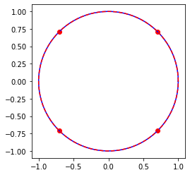

# Práctica 1 - Ejercicio 1  
Modificar el código para calcular la raíz enésima de cualquier número complejo y graficarla   


$$\; \; \; \; \; \; \; \; \; \; \; \; \; \; \; \; \; \; \; \; \; \; \; \; \; \; \; \;   \LARGE \sqrt[n] {z} $$


```python
import numpy as np
import sympy as sym
import matplotlib.pyplot as plt
from IPython.display import display, Math
```

Utilizo la siguiente expresión para calcular a través de una función las raices enesimas de un número complejo   

$$\LARGE w =  \sqrt[n] {z}  =  \sqrt[n] {r} \;   e^{i \frac{\theta + 2 k \pi}{n}}$$  
$$ \LARGE z = r e^{i\theta} \; \; \;   k \in Z \; \; \; 0 \leq k < n$$


```python
def nroot(z, n):
    for k in range(0, n):
        root=np.abs(z)**(1/n)*np.exp((np.angle(z) + 2*np.pi*k)*1j/n)
        rootsym=sym.Abs(z)**(1/n)*sym.exp((sym.arg(z) + 2*sym.pi*k)*sym.I/n)
        print(root)
        display(Math('(%s)^{%s} \\Rightarrow %s' %(sym.latex(rootsym),n, sym.latex(rootsym**n))))
        plt.plot(np.real(root), np.imag(root),'ro')
    x = np.linspace(0, 2*np.pi, 100)
    plt.plot(np.cos(x), np.sin(x), color='blue')
    plt.plot(np.abs(z)**(1/n)*np.cos(x),np.abs(z)**(1/n)* np.sin(x),'--', color='red')

    plt.axis('square')
    plt.show()
    return
```


```python
nroot(-1 ,4)
```

    (0.7071067811865476+0.7071067811865476j)


$\displaystyle (e^{\frac{i \pi}{4}})^{4} \Rightarrow -1$


    (-0.7071067811865475+0.7071067811865476j)


$\displaystyle (e^{\frac{3 i \pi}{4}})^{4} \Rightarrow -1$


    (-0.7071067811865477-0.7071067811865475j)


$\displaystyle (e^{- \frac{3 i \pi}{4}})^{4} \Rightarrow -1$


    (0.7071067811865474-0.7071067811865477j)


$\displaystyle (e^{- \frac{i \pi}{4}})^{4} \Rightarrow -1$




