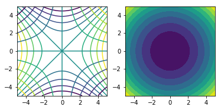
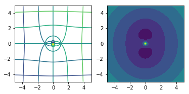
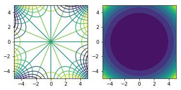
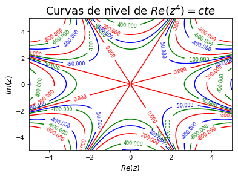

```python
import numpy as np
import matplotlib.pyplot as plt
```

```xx = np.linspace(-5, 5, 100)```
genero un vector de xx con 100 valores entre 5 y -5. Cambiar estos valores si se desea graficar otra región  
```yy = xx.copy()```
copio el vector xx en yy  
```X, Y = np.meshgrid(xx, yy)```
genero dos matrices X e Y con los valores de xx e yy  
X la primera fila varía de -5 a 5  y las columnas son constantes  
en Y , las filas son constantes y las columnas varían de -5 a 5  
```Z = X + 1j * Y```
Aca lo hago primero creando la variable Z = X + i Y  
de esta forma Z en la primer fila tiene la parte real cambia de -5 a 5  
y la parte imaginaria contante -0.5   
en la segunda fila idem pero imaginaria - 4.89  

```fza = Z ** 2```
Ahora calcula f(z) con la función dada
tambien lo podría haber hecho desarrollando y calculando u y v, pero no es tan directo

fz= X ** 2 - Y ** 2 + 2j * X * Y 
calcula la f(z) que ya calcule en papel


```python
xx = np.linspace(-5, 5, 100)    # genero un vector de xx con 100 valores entre 5 y -5
yy = xx.copy()                  # copio el vector xx en yy
X, Y = np.meshgrid(xx, yy)      # genero dos matrices X e Y con los valores de xx e yy
Z = X + 1j * Y                  # Aca lo hago primero creando las variables Z = X + i Y
fza = Z ** 2                    # Ahora calcula f(z) con la función dada
```

Grafico utilizando gráficos de nivel (Contour Plots)   
Lo hago con dos subplot el primero 


```python
fig, ax = plt.subplots(1,2)
plt.gcf().get_axes()[0].contour(X, Y, np.real(fza), 10)     # x^2 - y^2 = cte  parábolas
plt.gcf().get_axes()[0].contour(X, Y, np.imag(fza), 10)     # 2 x y = cte      hipérbolas
plt.gcf().get_axes()[0].axis('square')
plt.gcf().get_axes()[1].contourf(X, Y, np.abs(fza), 10)     # x^2 + y^2 = cte
plt.gcf().get_axes()[1].axis('square')                      # cortes horizontales de un paraboloide de revolución
```


    (-5.0, 5.0, -5.0, 5.0)





```python
fzb=Z + 1/Z
fig, ax = plt.subplots(1,2)
plt.gcf().get_axes()[0].contour(X, Y, np.real(fzb), 10)
plt.gcf().get_axes()[0].contour(X, Y, np.imag(fzb), 10)
plt.gcf().get_axes()[0].axis('square')
plt.gcf().get_axes()[1].contourf(X, Y, np.abs(fzb), 10)
plt.gcf().get_axes()[1].axis('square')
```


    (-5.0, 5.0, -5.0, 5.0)





```python
fzc=Z**4
fig, ax = plt.subplots(1,2)
plt.gcf().get_axes()[0].contour(X, Y, np.real(fzc), 10)
plt.gcf().get_axes()[0].contour(X, Y, np.imag(fzc), 10)
plt.gcf().get_axes()[0].axis('square')
plt.gcf().get_axes()[1].contourf(X, Y, np.abs(fzc), 10)
plt.gcf().get_axes()[1].axis('square')
```


    (-5.0, 5.0, -5.0, 5.0)





- Como último ejemplo hago la primera parte del último gráfico pero con más colores   
(con colors= va cambiando entre red, green y blue alternadamente)   
- y etiquetando el valor de la constante en cada curva (agrego parámetro levels)
previamente defino el vector levels con los valores que quiero que muestre
- con clabels agrega a cada curva su etiqueta  
- por último agraga título, y nombre a los ejes


```python
levels = [-800, -600, -400, -200, -100, -50, 0, 50, 100, 200, 400, 600, 800]
fig, ax = plt.subplots()
CS = ax.contour(X, Y, np.real(fzc), levels, colors=('r', 'g', 'b'))
ax.clabel(CS, inline=1, fontsize=8)
ax.set_title("Curvas de nivel de $Re (z^4) = cte$",fontsize=18)
ax.set_xlabel("$Re(z)$",fontsize=12)
ax.set_ylabel("$Im(z)$",fontsize=12)
```


    Text(0,0.5,'$Im(z)$')




