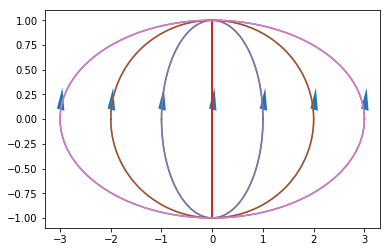

# Práctica 2 - Ejercicio 10  

Usando sympy realizar integración a lo largo de un camino, parametrizando el mismo
y convirtiendo la integral compleja en integrales reales. Aplicar a alguna integral ya resuelta
(por ej. 2d) y comparar con el resultado obtenido.

- Primero importo las librerías a utilizar.
- Con la librería Sympy, para cálculos simbólicos, creo las variable **z**, **t** y **f** como símbolos y **a** como real  


```python
from sympy import *
import numpy as np
import matplotlib.pyplot as plt
z, t, f = symbols('z t f')
a = symbols('a', real = True)
init_printing(use_unicode=True)
```

Resuelvo el ejercicio 2e)  
1) Escribo la parametrización de la curva  con 

```python
z = a * cos(t) + I * sin(t)         # parametrizo la curva sobre la que integro
```

2) Calculo la derivada de *z(t)*


```python
diff(z,t)                      # derivada de z(t)
```


3) Ingreso la *f(z)* del ejercicio 

```python
f = re(z**2)                   # calculo f(z(t))
```

4) Calculo la integral de *f(z)* entre *z1* a *z2* por el camino sobre la curva *C*   


```python
solucion=integrate(f*diff(z,t), (t, -pi/2, pi/2))    # calculos las integrales en la variable real t entre a y b
solucion.simplify()
```


```python
x = np.linspace(-np.pi, np.pi, 100)        # pasos para recorrer la curva parametrizada entre a y b, 0 y pi en este caso
```

```python
for k in range(-3, 4):
    plt.plot(k * np.cos(x) , np.sin(x))
    plt.arrow(k * np.cos(x[50]), np.sin(x[50]), 0.01, np.sin(x[51]) -  np.sin(x[50]), shape='full', lw=0, length_includes_head=False, head_width=.15)
    print('a = ', k, '; integral = ',solucion.evalf(subs={a:k}))
```

    a =  -3 ; integral =  11.3333333333333*I
    a =  -2 ; integral =  4.66666666666667*I
    a =  -1 ; integral =  0.666666666666667*I
    a =  0 ; integral =  -0.666666666666667*I
    a =  1 ; integral =  0.666666666666667*I
    a =  2 ; integral =  4.66666666666667*I
    a =  3 ; integral =  11.3333333333333*I


